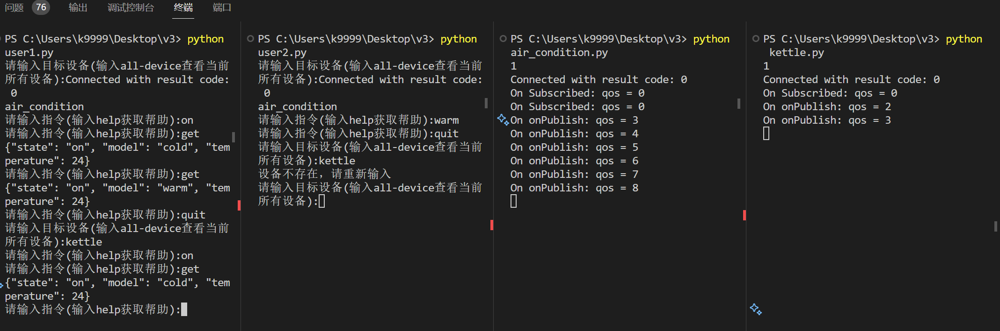

## 加密方案
采取**AES + RAS**的加密手段，其中AES用于加密数据，RAS用于加密AES的密钥。
加密过程如下：
1. 参数是要加密的文本和已经得到的RAS公钥
2. 获取时间戳，用于防治重放攻击
3. 随机生成AES密钥
4. 使用AES密钥加密文本
5. 将AES密钥与时间戳合并
6. 使用RAS公钥加密合并后的AES密钥
7. 返回加密后的AES密钥和加密后的文本

```python
def encryption(m, public_key_text):
    
    # 获取时间戳
    timestamp = int(time.time())
    timestamp_bytes = timestamp.to_bytes(8, byteorder="big")
    # 生成随机aes密钥
    aes_key = get_random_bytes(16)
    
    m = m.encode('ISO-8859-1') # 转换为字节流
    aes = AES.new(aes_key,AES.MODE_ECB)
    encry_m = aes.encrypt(pad(m,16)) # ECB需要填充

    combined_key = timestamp_bytes + aes_key # 将时间戳和aes密钥合并
    
    public_key = RSA.import_key(public_key_text)
    encry_key = PKCS1_OAEP.new(public_key).encrypt(combined_key)
    # 由于设计的数据包使用的是string，所以需要先由字节流转换为string
    encry_key = encry_key.decode('ISO-8859-1')
    encry_m = encry_m.decode('ISO-8859-1')

    return encry_key, encry_m
```
解密过程如下：
1. 参数是加密后的密文、加密后的AES密钥和RAS私钥
2. 使用RAS私钥解密AES密钥
3. 分离AES密钥和时间戳
4. 使用AES密钥解密密文
5. 返回解密后的文本和时间戳

```python
def decryption(encry_key, encry_text, private_key_text):

    # string转换为字节流
    encry_key = encry_key.encode('ISO-8859-1')
    encry_text = encry_text.encode('ISO-8859-1')

    combined_key = PKCS1_OAEP.new(private_key).decrypt(encry_key)
    
    # 获取时间戳和aes密钥
    extracted_timestamp = int.from_bytes(combined_key[:8], byteorder="big")
    aes_key = combined_key[8:]

    aes = AES.new(aes_key,AES.MODE_ECB)
    m = unpad(aes.decrypt(encry_text),16) # 去除填充

    m = m.decode('ISO-8859-1')
    return m, extracted_timestamp
```

## 数据包设计

数据包格式如下：
- `des`是目的客户端(用户或者是设备)，如果接收到不是自己的数据包就丢弃
- `encry_key`是加密过的aes密钥
- `encry_text`是由aes密钥加密过的数据
```python
packet = {
    'des': des,
    'encry_key': public_key_test,
    'encry_text': message
}
```

## 交互流程
1. 用户和设备分别连接到mqtt服务器。设备一旦登录就订阅自己user_list中的所有user(比如air_condition可以由user1和user2共同控制) 
2. 用户(user) 登录，输入想要交互的设备(device) 
3. 如果输入的device合法(存在且允许该用户访问)，使用`getRSAKey()`得到一对RSA密钥，将公钥发送给device(明文传输，这个数据包相当于请求连接)，将私钥保存在本地
4. device收到用户发送的含有RAS公钥的数据包，保存对应用户的公钥(不同用户的公钥分开存储)；使用同样方法生成一对RAS密钥，将公钥发送给用户，将私钥保存在本地
5. 此时用户和设备都有了对方的公钥，可以开始加密通信了
6. 每次发送的数据包中都有加密过后的aes密钥+时间戳，假如小于上一次的时间戳就丢弃，防止重放攻击

### 获取RSA密钥对

```python
def getRSAKey():
    key = RSA.generate(1024)
    private_key = key.export_key().decode()
    public_key = key.publickey().export_key().decode()
    return private_key, public_key
```

### 生成数据包

```python
def getPacket(des , message, public_key_test =''):
    if public_key_test == '': # 如果是请求连接的数据包
        packet = {
            'des': des,
            'encry_key': public_key_test,
            'encry_text': message
        }
    else :
        encry_key, encry_text = encryption(message, public_key_test)
        packet = {
            'des': des,
            'encry_key': encry_key,
            'encry_text': encry_text
        }
    return json.dumps(packet)
```

### 设备端处理用户请求

```python
def on_message(client, userdata, msg):
    global user_list
    if(msg.topic in user_list): # 如果不是合法的用户就丢弃
        proc_message(msg.payload.decode('utf-8') , msg.topic)

def proc_message(s ,res):
    global public_key, private_key, device_name, last_time_stamp
    rec_data = json.loads(s)
    des_device = rec_data['des']

    if des_device == device_name: # 如果不是发给自己的数据包就丢弃
        if rec_data['encry_key'] == '': # 如果是请求连接的数据包
            public_key[res] = rec_data['encry_text'] # 保存对应用户的公钥

            private_key[res], pub = getRSAKey() 
            s = getPacket(res, pub)

            client.publish(device_name, s) # 将自己的公钥发送给用户
            return
        else :
            rec_message, ex_timestamp = decryption(rec_data['encry_key'], rec_data['encry_text'], private_key[res])# 解密数据包
            if ex_timestamp < last_time_stamp: # 防治重放攻击
                print('消息过期')
                return
            last_time_stamp = ex_timestamp
    else:
        return
    message_handle(rec_message ,res) # 交给每个设备特有的处理函数
    return
```

### 用户端

```python
while True:
    while True:
        des_device = input("请输入目标设备(输入all-device查看当前所有设备):") # 输入目标设备
        if des_device == 'all-device':
            print(device_list)
            continue
        elif des_device in device_list:
            # 向目标设备发送连接请求
            private_key, pub= getRSAKey()
            cur_device = des_device
            client.subscribe(des_device, qos=0)
            s = getPacket(des_device, pub,'')
            client.publish(topic='user1', payload=s, qos=0, retain=False)
            time.sleep(2) # 防止还没接收到设备的公钥就发送数据包
            break
        else:
            print("设备不存在，请重新输入")
            continue

    while True:
        message = input("请输入指令(输入help获取帮助):")
        if message == 'help':
            print(help_string)
        elif message == 'quit':
            break
        else:
            send_pack = getPacket(des_device, message, public_key)
            client.publish(topic='user1', payload=send_pack, qos=0, retain=False)
            time.sleep(2)

def on_message(client, userdata, msg):
    global cur_device, private_key, public_key
    if(msg.topic != cur_device): return

    rec_data = json.loads(msg.payload.decode('utf-8'))
    if(rec_data['des'] != 'user1'): return
    if rec_data['encry_key'] == '':
        public_key = rec_data['encry_text'] # 保存设备的公钥
        return
    else:
        proc_message(rec_data)

def proc_message(data):
    global cur_device, private_key, public_key, last_time_stamp
    # print(private_key)
    message, ex_timestamp = decryption(data['encry_key'], data['encry_text'], private_key)
    if ex_timestamp < last_time_stamp: # 防治重放攻击
        print('消息过期')
        return
    last_time_stamp = ex_timestamp
    print(message)
```

## 使用方法

更改各个客户端连接的服务器(服务器中需要有对应的客户端)，更改用户的`device_list`和设备的`user_list`

## 效果展示



#### 补充说明

代码有很多功能不完善的地方，是一天速成的产物，仅供参考。